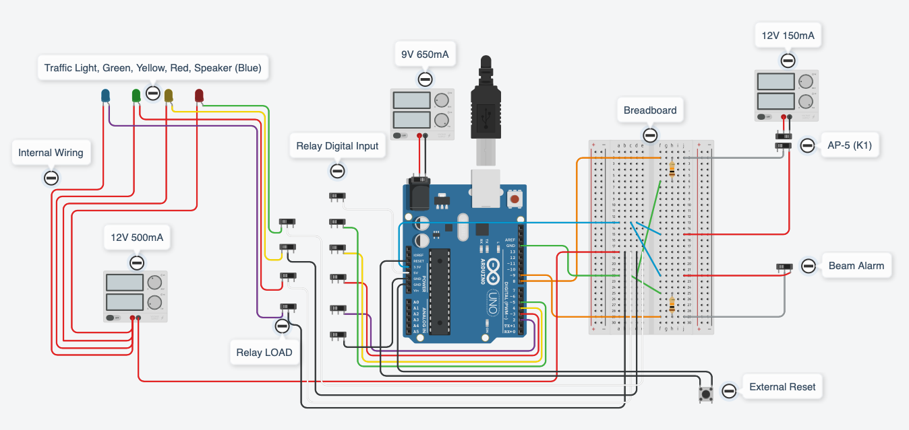
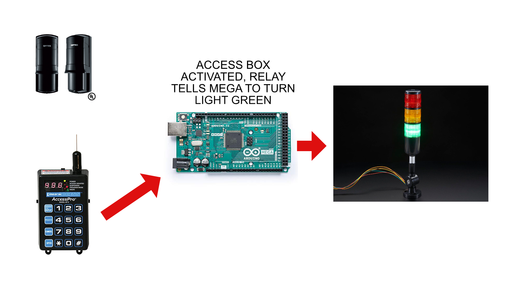
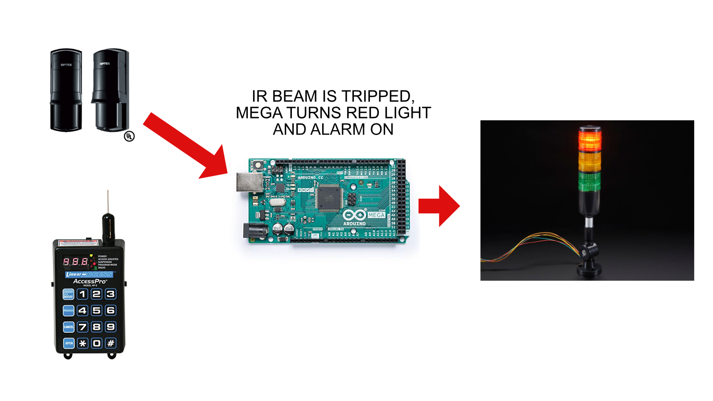
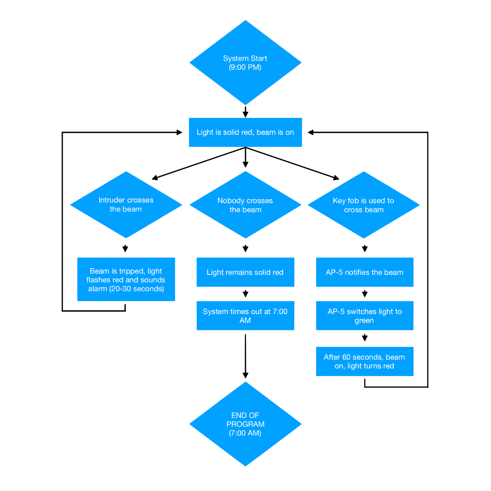

# Channel Access - Powered by Arduino

The --redacted-- marina channel employs two photoelectric beams which are activated during hours of darkness. The beams are integrated with an access controller and a traffic light which provides a visual display of the beam status (red light / green light) and allows boat owners to deactivate the beam via key fob, similar to a garage door opener. Crossing through the beams while activated will trigger a visual and audible alarm to notify the --redacted-- security team of unauthorized access. Each key fob has a unique 6-digit ID number, which is linked to the resident’s name.

# The Hardware Configuration

The entire system is configured using the following components:

- Arduino Mega 2560
- Linear AP-5 Wireless Receiver
- Optex Photoelectric Beam Detector
- Nxtop Industrial Lamp Post with Alarm
- ELEGOO 4 Channel 5V Relay
- 9V 650mA Power Supply
- 12V 500mA Power Supply
- Mini Breadboard with resistors

The Arduino is the main controller for the entire system, as it runs the software. The AP-5 and the Optex beams serve as inputs for the Mega, and the lamp post/alarm is the output. The system is physically configured as displayed in my design.

# How Everything Works Together

The Optex beams and the AP-5 each provide input to the Arduino Mega in a clear and straightforward way: built-in SPDT relays. This means each device has a default state. The beams are HIGH when line of sight is stable, and the AP-5 is LOW when not receiving signal from a known key fob. When either of those states change, the Arduino will either sound the alarm or provide access and temporarily ignore the state of the beams while the resident passes through the channel. The lamp post is controlled by a 4-channel SPDT relay, which is controlled by the Arduino. The relay enables the Arduino to easily control each colored LED and the audible alarm while also providing a higher voltage of 12V to the LEDs without having to worry about the Arduino's lower 9V input. Additionally, a reset button was added to the system for the security team should they need to disable the alarm, or the Arduino is stuck. The reset is wired to the GND and RESET inputs rather than being logically coded into the program. This makes more sense in practical application. 

# Simple Visual Process

A resident drives their boat through the channel, activates their key fob. The AP-5 checks the ID number and sees if it matches one of its known ID numbers from the database. The ID number matches. The accessGranted function runs, which turns the traffic light green and ignores input from the beams for s short period.

Jack Sparrow decides to enter the marina through the channel. He sails down the channel and trips the beam. The beam state inverts to LOW and the intruderAlert function runs, which activates a loud, ear-piercing alarm and flashes the red light to get the security team's attention to take action.

**Here's how the Channel Access system flows:**

# How to Use

1.	When you are within 50-75 feet of the photoelectric beams, activate your wireless key-fob by pressing and holding the gray button for 3-5 seconds. Note: A quick press of the button will not properly engage the receiver
2.	The traffic light mounted to the guard shack will turn GREEN and temporarily disable the beams for 60 seconds to allow boaters to pass through without sounding the alarm. 
3.	After 60 seconds have passed, the light will turn YELLOW and begin a 20-second countdown sequence to notify you that the system will soon be re-armed. You cannot restart the countdown by pressing your key fob again.
4.	Once the countdown sequence finishes, the light will revert back to its default state, RED, and will be re-armed.

**Intruder Alert Alarm:**

In the event that an unauthorized person attempts to enter through the photoelectric beams, the system will sound a 20-second visual and audible alarm to alert nearby security personnel. The amount of time the alarm sounds can be changed upon request.

**How to Reset the System:**

In the event of a system malfunction or a false alarm, security personnel at the channel guard shack can press the reset button, located on the right side of the green box inside the guard shack. The system will be reset and rearmed within 5 seconds.

**Powering the System On & Off:**

All main system components will be connected to a central power strip which can be powered on and off by toggling the red switch on the strip. It’s ideal to turn off the system during the day and turn it on at night when the guard shack is manned. 

**Maintaining Integrity & Security:**

A critical element of this system is need for accountability of key fobs.  This is why it’s imperative that the Key-Fob Directory is maintained and that boat owners report when a key fob is lost so the serial number can be removed from the database.

# Troubleshooting

To troubleshoot the Channel Access System, please review my [troubleshooting documentation](https://drive.google.com/file/d/1VE9fCSNxwDPs-8gqW1xlZSqOOrzAkF2S/view?usp=sharing )

 